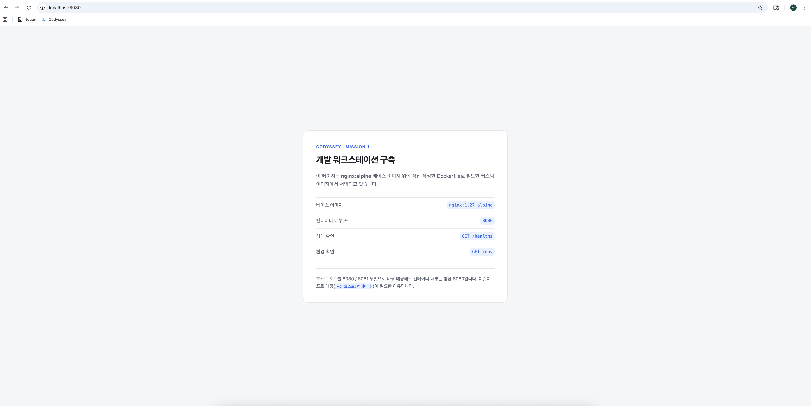
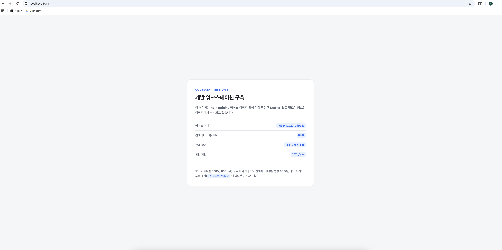
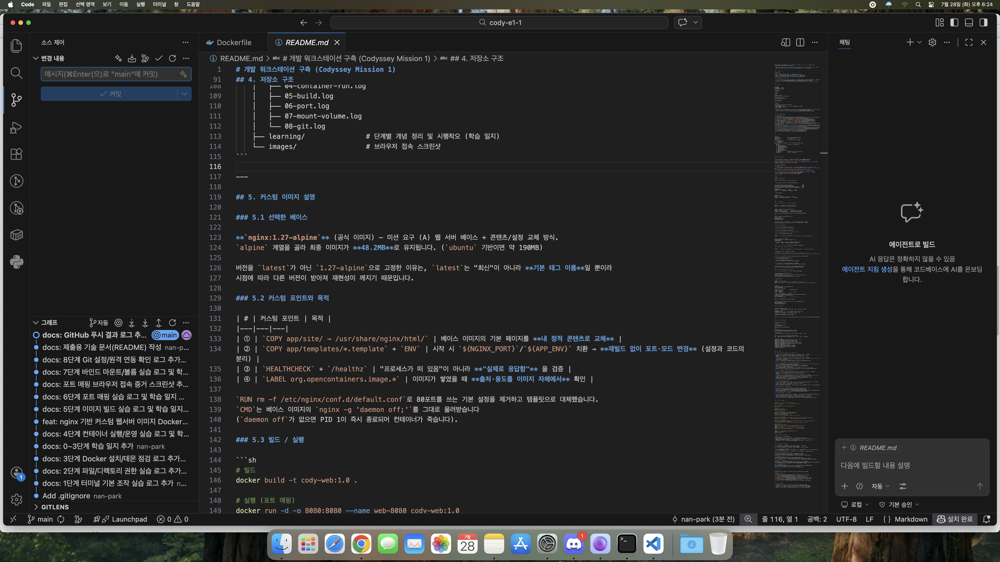
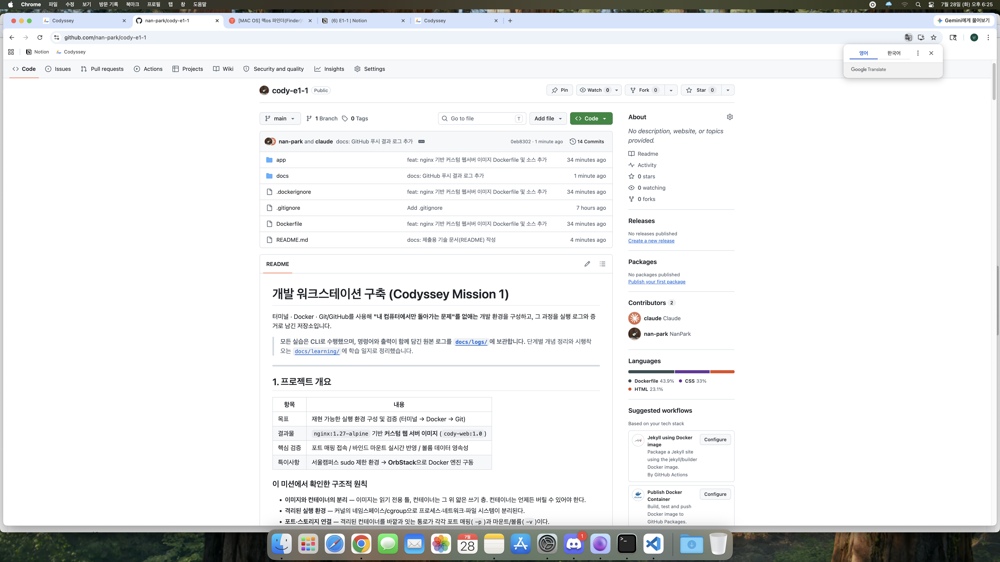
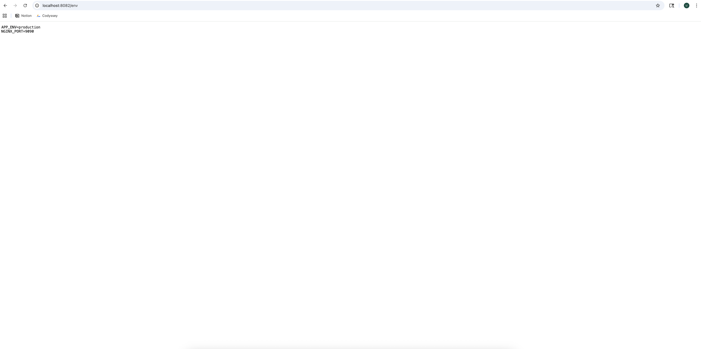

# 개발 워크스테이션 구축 (Codyssey Mission 1)

터미널 · Docker · Git/GitHub로 **"내 컴퓨터에서만 돌아가는 문제"를 없애는** 개발 환경을 구성하고,
각 단계에서 이해한 개념과 그것을 확인한 실행 증거를 함께 남긴 저장소입니다.

> 문서는 **실습한 순서**대로 이어집니다. 각 절은 `개념 → 증거(로그/스크린샷)` 한 묶음입니다.
> 인용된 로그는 모두 원본 [`docs/logs/`](docs/logs)에서 잘라온 것이고, 더 자세한 개념 정리와 시행착오는 [`docs/learning/`](docs/learning)에 있습니다.

---

## 0. 한 장 요약

| 항목 | 내용 |
|---|---|
| 목표 | 재현 가능한 실행 환경 구성 및 검증 (터미널 → Docker → Git) |
| 결과물 | `nginx:1.27-alpine` 기반 **커스텀 웹 서버 이미지** `cody-web:1.0` (48.2MB) |
| 핵심 검증 | 포트 매핑 접속 · 바인드 마운트 실시간 반영 · 볼륨 데이터 영속성 |
| 특이사항 | 서울캠퍼스 sudo 제한 환경 → **OrbStack**으로 Docker 엔진 구동 |

이 미션을 관통하는 세 가지 원칙입니다. 아래 모든 절은 결국 이 셋 중 하나를 눈으로 확인하는 과정이었습니다.

- **이미지와 컨테이너의 분리** — 이미지는 읽기 전용 틀, 컨테이너는 그 위의 얇은 쓰기 층. 컨테이너는 언제든 버릴 수 있어야 한다. → [2절](#2-docker-점검과-컨테이너-실행), [3절](#3-내-이미지-만들기--dockerfile)
- **격리된 실행 환경** — 커널의 네임스페이스/cgroup으로 프로세스·네트워크·파일 시스템이 분리된다. → [4절](#4-포트-매핑--격리된-컨테이너에-길을-내주기)
- **포트·스토리지 연결** — 격리된 컨테이너를 바깥과 잇는 통로가 각각 포트 매핑(`-p`)과 마운트/볼륨(`-v`)이다. → [4절](#4-포트-매핑--격리된-컨테이너에-길을-내주기), [5절](#5-바인드-마운트와-볼륨--파일은-어디에-남는가)

### 실행 환경

```
$ sw_vers | head -2 && echo $SHELL && uname -m
ProductName:     macOS          # OS: macOS 15.7.4 (Darwin 24.6.0)
ProductVersion:  15.7.4
/bin/zsh                        # 셸/터미널: zsh
x86_64                          # 아키텍처

$ docker --version && docker compose version && git --version
Docker version 28.5.2, build ecc6942      # 런타임은 OrbStack 컨텍스트 (sudo 불필요)
Docker Compose version v2.40.3
git version 2.53.0
```

### 수행 항목 체크리스트

| 영역 | 수행 내용 | 상태 | 증거 |
|---|---|---|---|
| 터미널 | 위치·목록(숨김 포함)·이동·생성·복사·이름변경·삭제·내용확인·빈 파일, 절대/상대 경로 | ✅ | [1절](#1-터미널--경로--권한) · [01-terminal.log](docs/logs/01-terminal.log) |
| 권한 | 파일 1개 + 디렉토리 1개 권한 변경 전/후 비교 (`r`/`w`/`x` 각각) | ✅ | [1절](#12-권한--rwx와-755644) · [02-permission.log](docs/logs/02-permission.log) |
| Docker 점검 | `docker --version`, `docker info`(데몬 동작), `docker context ls` | ✅ | [2절](#21-cli와-데몬은-다른-프로그램이다) · [03-docker-check.log](docs/logs/03-docker-check.log) |
| 컨테이너 실행 | `hello-world`, `ubuntu` 내부 진입, exec/attach 차이, `logs`·`stats`·`ps -a`·`images` | ✅ | [2절](#22-이미지와-컨테이너는-별개다) · [04-container-run.log](docs/logs/04-container-run.log) |
| 컨테이너 정리 | `stop`/`start`/`rm -f`/`container prune`, dangling 이미지 정리 | ✅ | [2.5절](#25-컨테이너-정리--지워도-이미지는-남는다) · [04-container-run.log](docs/logs/04-container-run.log) |
| Dockerfile | 직접 작성 → 커스텀 이미지 빌드 → 컨테이너 실행 | ✅ | [3절](#3-내-이미지-만들기--dockerfile) · [Dockerfile](Dockerfile) · [05-build.log](docs/logs/05-build.log) |
| 포트 매핑 | 서로 다른 호스트 포트로 2회 접속 (브라우저 화면 증거) | ✅ | [4절](#4-포트-매핑--격리된-컨테이너에-길을-내주기) · [06-port.log](docs/logs/06-port.log) |
| 마운트/볼륨 | 바인드 마운트 변경 전/후, 볼륨 컨테이너 삭제 전/후 | ✅ | [5절](#5-바인드-마운트와-볼륨--파일은-어디에-남는가) · [07-mount-volume.log](docs/logs/07-mount-volume.log) |
| Git / GitHub | 사용자·기본 브랜치 설정, 원격 연동 및 push, VSCode 연동 | ✅ | [6절](#6-git과-github) · [08-git.log](docs/logs/08-git.log) |
| 보너스 | 환경 변수 주입 · Compose 멀티 컨테이너 · GitHub SSH 키 | ✅ | [7절](#7-보너스-과제) |

---

## 1. 터미널 · 경로 · 권한

### 1.1 절대 경로와 상대 경로

**절대경로**는 최상위 `/`부터 시작하는 전체 주소라 **어디서 실행해도 같은 곳**을 가리키고,
**상대경로**는 현재 위치(`pwd`) 기준이라 **내가 이동하면 표기가 달라집니다.**
같은 파일이 `practice`에서는 `./src/hello.txt`지만, `src`로 들어가면 `./hello.txt`가 됩니다.

```
$ pwd
/Users/nika.dev02147536/codyssey/practice

$ cat ./src/hello.txt                                          # 상대경로
line1
line2

$ cat /Users/nika.dev02147536/codyssey/practice/src/hello.txt   # 절대경로 — 같은 파일
line1
line2
```

스크립트나 Docker 실행 옵션처럼 **실행 위치를 보장할 수 없는 곳에서는 절대경로**를 씁니다.
(실제로 바인드 마운트에서 상대경로를 쓰면 Docker가 이를 경로가 아닌 **볼륨 이름**으로 해석합니다.)

기본 조작(생성·복사·이름변경·삭제·숨김 파일 확인 등) 전체 로그는 [`01-terminal.log`](docs/logs/01-terminal.log)에 있습니다.

<details>
<summary>기본 조작 로그 발췌</summary>

```
$ mkdir -p ~/codyssey/practice/src ~/codyssey/practice/backup
$ ls -la                                             # 숨김 파일(. ..) 포함 확인
drwxr-xr-x  2 nika.dev02147536  ...  backup
drwxr-xr-x  2 nika.dev02147536  ...  src

$ touch notes.txt                                    # 빈 파일 생성
$ echo "line1" > src/hello.txt                       # 덮어쓰기
$ echo "line2" >> src/hello.txt                      # 이어쓰기
$ cp src/hello.txt backup/hello_copy.txt             # 복사
$ mv backup/hello_copy.txt backup/hello_backup.txt   # 이동 = 이름변경
$ rm backup/newfile.txt                              # 삭제
```
</details>

### 1.2 권한 — r/w/x와 755·644

`r`(읽기)=4, `w`(쓰기)=2, `x`(실행)=1이고, 이를 **소유자·그룹·기타** 세 묶음으로 각각 더한 것이 숫자 표기입니다.
`755 = rwxr-xr-x`, `644 = rw-r--r--`.

**핵심은 디렉토리에서 의미가 달라진다는 점**입니다.

| 권한 | 파일에서 | 디렉토리에서 |
|---|---|---|
| `r` | 내용 읽기 | 목록 조회(`ls`) |
| `w` | 내용 수정 | **내부 파일 생성/삭제** |
| `x` | 프로그램으로 실행 | **진입(`cd`)과 내부 파일 접근** |

**증거 ① 파일 — `644`에는 실행 권한이 없다**

```
$ ls -l run.sh
-rw-r--r--  1 nika.dev02147536  nika.dev02147536  38  7 28 16:06 run.sh
$ ./run.sh
(eval):1: permission denied: ./run.sh          ← 변경 전

$ chmod 755 run.sh
$ ls -l run.sh
-rwxr-xr-x  1 nika.dev02147536  nika.dev02147536  38  7 28 16:06 run.sh
$ ./run.sh
permission-practice-ok                          ← 변경 후
```

**증거 ② 디렉토리 — `x`를 빼면 목록은 보여도 내용은 못 읽는다**

디렉토리에서 `x`가 빠지면 `cd`도, 안의 파일 접근도 막힙니다. 파일 이름만 보이고 내용은 못 읽는 상태가 됩니다.

```
$ chmod 644 backup && ls -ld backup
drw-r--r--  4 nika.dev02147536  nika.dev02147536  128  7 28 16:06 backup

$ cd backup
(eval):cd:1: permission denied: backup          ← 진입 불가

$ ls backup
ls: fts_read: Permission denied
hello_backup.txt                                ← 이름은 보임 (r 이 살아있으므로)

$ cat backup/hello_backup.txt
cat: backup/hello_backup.txt: Permission denied ← 내용은 못 읽음

$ chmod 755 backup
$ cat backup/hello_backup.txt
line1                                           ← 복구
line2
```

이 `x`의 감각이 나중에 **SSH 개인키 권한 600**([7.3절](#73-github-ssh-키))에서 실제로 다시 쓰였습니다.
쓰기 권한(`w`) 차단 실험 등 나머지는 [`02-permission.log`](docs/logs/02-permission.log) · [학습 일지 2단계](docs/learning/02-permission.md).

---

## 2. Docker 점검과 컨테이너 실행

### 2.1 CLI와 데몬은 다른 프로그램이다

`docker` 명령은 **클라이언트일 뿐**이고, 실제로 컨테이너를 만드는 것은 **데몬(엔진)** 입니다.
그래서 점검도 두 단계로 나뉩니다 — `--version`은 CLI 확인, `info`의 `Server:` 섹션 응답이 데몬 확인입니다.

```
$ docker --version                    # ① 클라이언트(CLI)
Docker version 28.5.2, build ecc6942

$ docker info | head -20              # ② 데몬(엔진) — Server 섹션이 응답하면 정상
Client:
 Context:    orbstack
...
Server:
 Server Version: 28.5.2
 Storage Driver: overlay2
 Cgroup Version: 2
```

**OrbStack을 쓴 이유**: 기본 Docker는 `/var/run/docker.sock`(시스템 영역)을 써서 설치·제어에 관리자 권한이 필요한데,
OrbStack은 소켓을 홈 디렉토리에 두어 **sudo 없이** 동작합니다.

```
$ docker context ls
NAME         DOCKER ENDPOINT
default      unix:///var/run/docker.sock                            ← 시스템 영역 (sudo 필요)
orbstack *   unix:///Users/nika.../.orbstack/run/docker.sock        ← 홈 디렉토리 (내 권한으로 접근)
```

전체 출력: [`03-docker-check.log`](docs/logs/03-docker-check.log)

### 2.2 이미지와 컨테이너는 별개다

`hello-world`를 실행하면 이미지를 받아 **컨테이너를 만들고 → 출력하고 → 종료**합니다.
종료 후 `docker ps`에는 아무것도 없지만 `docker ps -a`에는 남아 있습니다.
**"컨테이너가 없다"가 아니라 "실행 중인 컨테이너가 없다"** 는 뜻이고, 이미지는 그대로 남습니다.

```
$ docker run hello-world
Unable to find image 'hello-world:latest' locally     ← 없으면 자동으로 pull
...
Hello from Docker!

$ docker images                       # 이미지: 남아 있음
REPOSITORY    TAG      IMAGE ID       SIZE
hello-world   latest   e2ac70e7319a   10.1kB

$ docker ps                           # 실행 중: 없음
CONTAINER ID   IMAGE     COMMAND   STATUS   NAMES

$ docker ps -a                        # 전체: 종료된 상태로 남아 있음
CONTAINER ID   IMAGE         COMMAND    STATUS                     NAMES
2951c374aebf   hello-world   "/hello"   Exited (0) 9 seconds ago   angry_johnson
```

`ubuntu` 컨테이너에 들어가 보면, 호스트가 macOS인데도 안은 **완전한 Ubuntu 파일 시스템**입니다.

```
$ docker run -it --name ubuntu-lab ubuntu:24.04 bash
root@227c9a06f727:/# head -2 /etc/os-release
PRETTY_NAME="Ubuntu 24.04.4 LTS"
root@227c9a06f727:/# cat /etc/hostname
227c9a06f727                          ← 컨테이너 ID = 호스트네임 (격리된 자기 세계)
root@227c9a06f727:/# exit
```

### 2.3 exec와 attach의 차이 — PID 1

직접 관찰해서 정리한 부분입니다. 둘 다 "컨테이너에 들어간다"처럼 보이지만 결과가 정반대였습니다.

| | `docker exec -it` | `docker attach` |
|---|---|---|
| 하는 일 | 컨테이너 안에 **새 프로세스**를 띄움 | 이미 돌고 있는 **PID 1에 직접 붙음** |
| `exit` 하면 | 내가 띄운 프로세스만 종료, **컨테이너는 계속 실행** | **PID 1이 종료 → 컨테이너도 죽음** |

```
$ docker exec -it ubuntu-daemon bash
root@f9b3d044178e:/# ps -ef
UID    PID  PPID CMD
root     1     0 sleep infinity        ← 원래 메인 프로세스
root    16     0 bash                  ← exec 로 새로 생긴 프로세스 (PID 1 아님)
root@f9b3d044178e:/# exit

$ docker ps --format "table {{.Names}}\t{{.Status}}"
NAMES           STATUS
ubuntu-daemon   Up 31 seconds          ← 컨테이너는 살아 있음 ✅
```

```
$ docker attach ubuntu-attach
root@12d7b7a2030b:/# ps -ef | cat
root     1     0 bash                  ← 내가 붙은 것이 곧 PID 1
root@12d7b7a2030b:/# exit

$ docker ps -a --format "table {{.Names}}\t{{.Status}}"
ubuntu-attach   Exited (0) Less than a second ago    ← 컨테이너 종료됨 ❌
```

**컨테이너의 수명은 PID 1의 수명과 같다** — 실행 중인 컨테이너를 들여다볼 때는 `exec`를 씁니다.
이 원리 때문에 나중에 nginx도 `daemon off;`로 **포그라운드**에서 돌려야 합니다([3.2절](#32-커스텀-포인트와-목적)).

### 2.4 운영 명령 — logs / stats

`docker logs`는 컨테이너의 **표준출력**을 보여줍니다. 컨테이너 로그가 "파일"이 아니라 "출력 스트림"이라는 걸
아래처럼 PID 1의 stdout(`/proc/1/fd/1`)에 직접 써넣어 확인했습니다.

```
$ docker exec ubuntu-daemon sh -c "echo hello-log-line > /proc/1/fd/1"
$ docker logs ubuntu-daemon
hello-log-line

$ docker stats --no-stream
CONTAINER ID   NAME            CPU %   MEM USAGE / LIMIT   MEM %   PIDS
f9b3d044178e   ubuntu-daemon   0.00%   900KiB / 15.67GiB   0.01%   1
                                       ↑ VM(수 GB)과 달리 프로세스 하나 수준
```

### 2.5 컨테이너 정리 — 지워도 이미지는 남는다

컨테이너는 **버리는 것을 전제로 만드는 것**입니다. `stop`(중지) → `start`(재시작) → `rm`(삭제)까지
한 사이클을 돌려보고, 마지막에 남은 것과 사라진 것을 대조했습니다.

**중지는 삭제가 아닙니다.** `stop` 후에도 컨테이너는 `Exited` 상태로 남아 있고, `start`로 그대로 되살아납니다.

```
$ docker stop ubuntu-daemon
ubuntu-daemon

$ docker ps -a --format "table {{.Names}}\t{{.Status}}"
NAMES           STATUS
ubuntu-attach   Exited (0) 21 seconds ago
ubuntu-daemon   Exited (137) Less than a second ago     ← 중지됐지만 남아 있음
ubuntu-lab      Exited (0) 27 minutes ago

$ docker start ubuntu-daemon           ← 그대로 되살아난다
ubuntu-daemon
```

여기서 종료 코드가 `Exited (137)`인 게 눈에 띄었습니다. `137 = 128 + 9`, 즉 **SIGKILL로 죽었다**는 뜻입니다.
`docker stop`은 먼저 SIGTERM을 보내고 기다렸다가 응답이 없으면 SIGKILL을 보내는데,
PID 1인 `sleep infinity`는 SIGTERM을 처리하지 않으니 결국 강제 종료된 것입니다. (정상 종료는 위 `Exited (0)`)

```
$ docker rm -f ubuntu-daemon ubuntu-attach ubuntu-lab     # 실행 중이어도 강제 삭제
ubuntu-daemon
ubuntu-attach
ubuntu-lab

$ docker container prune -f                               # 종료 상태로 남은 것 일괄 정리
Deleted Containers:
2951c374aebf9e46254eef64f34a6394b12f4fed695a3aab15e3ad066dae9b7c

$ docker ps -a                                            # 컨테이너: 전부 사라짐
CONTAINER ID   IMAGE     COMMAND   CREATED   STATUS    PORTS     NAMES

$ docker images                                           # 이미지: 그대로 남아 있음 ✅
REPOSITORY    TAG       IMAGE ID       CREATED        SIZE
ubuntu        24.04     ef91e4b15da8   5 weeks ago    78.1MB
hello-world   latest    e2ac70e7319a   4 months ago   10.1kB
```

**컨테이너를 다 지웠는데 이미지는 남아 있다** — [2.2절](#22-이미지와-컨테이너는-별개다)의 "이미지와 컨테이너는 별개"를
가장 잘 보여주는 장면입니다. 언제든 같은 이미지로 다시 만들면 됩니다.

이미지 쪽도 정리했습니다. [3.3절](#33-빌드-결과와-레이어캐시)에서 콘텐츠를 고쳐 같은 태그로 재빌드하면
`cody-web:1.0`이라는 **이름표가 새 이미지로 옮겨가고 이전 이미지는 이름을 잃습니다.** 이것이 `<none>` 이미지입니다.

```
$ docker images -f "dangling=true"
REPOSITORY   TAG       IMAGE ID       CREATED          SIZE
<none>       <none>    2c222dde262a   24 minutes ago   48.2MB     ← 재빌드로 이름을 잃은 이전 이미지

$ docker image prune -f
Deleted Images:
deleted: sha256:2c222dde262a9a4928561fe451ce3b081085c4e3c121537187dd7067237bdca8
```

정리를 안 하면 실제로 문제가 생깁니다. [8절 ③](#8-트러블슈팅)에서 실패한 컨테이너를 방치했다가
다음 실행 때 **"이름이 이미 존재한다"는 별개의 에러**를 만났습니다.
이후 단계에서도 실습이 끝날 때마다 정리했습니다 — [`06-port.log`](docs/logs/06-port.log)(`web-nomap`, `web-dup`),
[`07-mount-volume.log`](docs/logs/07-mount-volume.log)(`web-8081`, `web-9090`, `novol`, `vol-test1`, `vol-test2`),
[`09-compose.log`](docs/logs/09-compose.log)(`docker compose down`).

전체 출력: [`04-container-run.log`](docs/logs/04-container-run.log) · [학습 일지 4단계](docs/learning/04-container-run.md)

---

## 3. 내 이미지 만들기 — Dockerfile

### 3.1 선택한 베이스

**`nginx:1.27-alpine`** (공식 이미지) — 미션 요구 (A) *웹 서버 베이스 + 콘텐츠/설정 교체* 방식입니다.
`alpine` 계열을 골라 최종 이미지가 **48.2MB**로 유지됩니다. (`ubuntu` 기반이면 약 190MB)

태그를 `latest`가 아니라 `1.27-alpine`으로 **고정**한 이유는, `latest`가 "최신"이 아니라 그냥 **기본 태그 이름**일 뿐이라
받는 시점에 따라 다른 버전이 와서 재현성이 깨지기 때문입니다.

### 3.2 커스텀 포인트와 목적

| # | 커스텀 포인트 | 목적 |
|---|---|---|
| ① | `COPY app/site/ → /usr/share/nginx/html/` | 베이스의 기본 페이지를 **내 정적 콘텐츠로 교체** |
| ② | `COPY *.template` + `ENV APP_ENV`/`NGINX_PORT` | 시작 시 변수 치환 → **재빌드 없이 포트·모드 변경** (설정과 코드의 분리) |
| ③ | `HEALTHCHECK` + `/healthz` | "프로세스가 떠 있음"이 아니라 **"실제로 응답함"** 을 검증 |
| ④ | `LABEL org.opencontainers.image.*` | 이미지가 쌓였을 때 **출처·용도를 이미지 자체에서** 확인 |

```dockerfile
FROM nginx:1.27-alpine

LABEL org.opencontainers.image.title="cody-web" \
      org.opencontainers.image.source="https://github.com/nan-park/cody-e1-1"   # ④
ENV APP_ENV=dev \
    NGINX_PORT=8080                                                             # ②의 기본값

COPY app/site/ /usr/share/nginx/html/                                           # ①
RUN rm -f /etc/nginx/conf.d/default.conf          # 80 포트를 쓰는 기본 설정 제거
COPY app/templates/default.conf.template /etc/nginx/templates/default.conf.template   # ②

EXPOSE 8080                                        # 문서용 선언 (실제 공개는 docker run -p 가 결정)
HEALTHCHECK --interval=10s --timeout=3s --start-period=5s --retries=3 \
    CMD wget -q -O /dev/null http://127.0.0.1:${NGINX_PORT}/healthz || exit 1   # ③
```

`CMD`는 베이스 이미지의 `nginx -g 'daemon off;'`를 그대로 물려받습니다.
`daemon off`가 없으면 nginx가 백그라운드로 빠지면서 **PID 1이 즉시 끝나 컨테이너가 죽습니다** ([2.3절](#23-exec와-attach의-차이--pid-1)과 같은 원리).

전체: [`Dockerfile`](Dockerfile)

### 3.3 빌드 결과와 레이어·캐시

```
$ docker build -t cody-web:1.0 .
#6 [2/4] COPY app/site/ /usr/share/nginx/html/                     DONE
#7 [3/4] RUN rm -f /etc/nginx/conf.d/default.conf                  DONE
#8 [4/4] COPY app/templates/default.conf.template /etc/nginx/...   DONE
#9 naming to docker.io/library/cody-web:1.0                        DONE

$ docker images
REPOSITORY   TAG   IMAGE ID       CREATED          SIZE
cody-web     1.0   9316f625dded   14 seconds ago   48.2MB
```

**Dockerfile 명령 한 줄 = 이미지의 층 하나**이고, 한 층이 바뀌면 **그 아래 순서의 층부터 캐시가 무효화**됩니다.
같은 상태로 재빌드하면 전부 `CACHED`지만, 콘텐츠를 한 줄 고치자 `COPY` 이후가 모두 다시 실행됐습니다.

```
$ docker build -t cody-web:1.0 .                        # ① 아무것도 안 바꾸고 재빌드
#6 CACHED / #7 CACHED / #8 CACHED                        ← 전부 캐시 재사용

$ echo "<!-- cache test -->" >> app/site/index.html      # ② 콘텐츠 1줄 수정 후 재빌드
$ docker build -t cody-web:1.0 .
#6 [2/4] COPY app/site/ ...   DONE                       ← 여기서부터 다시 실행
#7 [3/4] RUN ...              DONE
#8 [4/4] COPY ...             DONE
```

헬스체크도 실제로 동작합니다. 실행 직후엔 `health: starting`, 응답이 확인되면 `healthy`로 바뀝니다.

```
$ docker ps
NAMES       STATUS
web-8080    Up Less than a second (health: starting)
web-8080    Up 30 seconds (healthy)              ← 14초 뒤
```

전체 출력: [`05-build.log`](docs/logs/05-build.log) · [학습 일지 5단계](docs/learning/05-build.md)

---

## 4. 포트 매핑 — 격리된 컨테이너에 길을 내주기

컨테이너는 **자기만의 네트워크 네임스페이스**를 가져 호스트와 분리되어 있습니다.
그래서 컨테이너 안에서 8080이 열려 있어도 호스트에서는 닿지 않고,
`-p 호스트포트:컨테이너포트`로 **통로를 뚫어야** 접근할 수 있습니다.

그리고 이 격리 덕분에, **여러 컨테이너가 내부적으로 같은 8080을 쓰더라도 호스트 포트만 다르면 동시에 실행**됩니다.

```sh
docker run -d -p 8080:8080 --name web-8080 cody-web:1.0
docker run -d -p 8081:8080 --name web-8081 cody-web:1.0
```

```
$ docker ps --format "table {{.Names}}\t{{.Ports}}"
NAMES      PORTS
web-8081   0.0.0.0:8081->8080/tcp      ← 호스트 8081 → 컨테이너 8080
web-8080   0.0.0.0:8080->8080/tcp      ← 호스트 8080 → 컨테이너 8080

$ curl -s http://localhost:8080/healthz && curl -s http://localhost:8081/healthz
ok
ok

$ curl -s -i http://localhost:8080/ | head -4
HTTP/1.1 200 OK
Server: nginx/1.27.5
Content-Type: text/html
Content-Length: 1159
```

### 브라우저 접속 증거

**① http://localhost:8080**



**② http://localhost:8081 — 같은 이미지, 다른 포트**



> 재빌드 없이 `-e`로 **포트·모드까지 바꾸는** 실습은 보너스 항목이라 [7.2절](#72-환경-변수-활용)에 정리했습니다.

전체 출력: [`06-port.log`](docs/logs/06-port.log) · [학습 일지 6단계](docs/learning/06-port.md)

---

## 5. 바인드 마운트와 볼륨 — 파일은 어디에 남는가

같은 `-v` 옵션이지만 목적이 다릅니다.

| | 바인드 마운트 | 볼륨 |
|---|---|---|
| 연결 대상 | **호스트의 특정 경로** | **Docker가 관리하는 저장소** |
| 쓰는 곳 | 개발 중 소스 실시간 반영 | DB·업로드 파일 등 운영 데이터 |
| 수명 | 호스트 파일에 종속 | 컨테이너를 지워도 남음 |

### 5.1 바인드 마운트 — 호스트 변경 전/후

```sh
docker run -d -p 8083:8080 -v "$(pwd)/app/site:/usr/share/nginx/html:ro" --name web-bind cody-web:1.0
```

| | 8080 (이미지에 `COPY`) | 8083 (바인드 마운트) |
|---|---|---|
| **변경 전** | `<h1>개발 워크스테이션 구축</h1>` | `<h1>개발 워크스테이션 구축</h1>` |
| **호스트 `index.html` 수정 후** | `<h1>개발 워크스테이션 구축</h1>` (그대로) | `<h1>… — 바인드 마운트 반영 테스트</h1>` **즉시 반영** |

```
$ perl -pi -e 's|구축</h1>|구축 — 바인드 마운트 반영 테스트</h1>|' app/site/index.html

$ curl -s http://localhost:8080/ | grep "<h1>"
    <h1>개발 워크스테이션 구축</h1>

$ curl -s http://localhost:8083/ | grep "<h1>"
    <h1>개발 워크스테이션 구축 — 바인드 마운트 반영 테스트</h1>
```

**빌드도 재시작도 하지 않았는데** 마운트한 쪽만 바뀌었습니다.
이미지에 `COPY`된 파일은 빌드 시점에 **복사되어 굳은 것**이고, 마운트는 호스트 파일을 **실시간으로 겹쳐 보여주는 것**이기 때문입니다.

`:ro`(읽기 전용)를 붙이면 컨테이너가 내 소스를 건드리는 것도 막을 수 있습니다.

```
$ docker exec web-bind sh -c "echo test >> /usr/share/nginx/html/index.html"
sh: can't create /usr/share/nginx/html/index.html: Read-only file system
```

### 5.2 볼륨 영속성 — 컨테이너 삭제 전/후

먼저 **볼륨이 없으면 데이터가 사라지는 것**을 대조군으로 확인했습니다.
컨테이너에서 만든 파일은 컨테이너의 쓰기 층에 있어서 `docker rm`과 함께 사라집니다.

```
$ docker exec novol cat /data/important.txt
중요한 사용자 데이터
$ docker rm -f novol && docker run -d --name novol ubuntu:24.04 sleep infinity
$ docker exec novol cat /data/important.txt
cat: /data/important.txt: No such file or directory     ← 소실
```

볼륨을 붙이면 같은 조건에서도 데이터가 살아남습니다.

```
$ docker volume create cody-data
$ docker run -d --name vol-test1 -v cody-data:/data ubuntu:24.04 sleep infinity
$ docker exec vol-test1 sh -c 'echo "중요한 사용자 데이터" > /data/important.txt; date >> /data/important.txt'

[ 삭제 전 ]
$ docker exec vol-test1 cat /data/important.txt
중요한 사용자 데이터
Tue Jul 28 09:02:34 UTC 2026

$ docker rm -f vol-test1              ← 컨테이너 강제 삭제
$ docker volume ls
local     cody-data                    ← 볼륨은 살아있음

[ 삭제 후 · 새 컨테이너에 같은 볼륨 연결 ]
$ docker run -d --name vol-test2 -v cody-data:/data ubuntu:24.04 sleep infinity
$ docker exec vol-test2 cat /data/important.txt
중요한 사용자 데이터
Tue Jul 28 09:02:34 UTC 2026           ← 날짜까지 그대로 유지 ✅

# 볼륨은 특정 컨테이너에 묶이지 않으므로 다른 이미지(alpine)에서도 접근된다
$ docker run --rm -v cody-data:/data alpine cat /data/important.txt
중요한 사용자 데이터
Tue Jul 28 09:02:34 UTC 2026
두번째 컨테이너가 추가한 줄
```

전체 출력: [`07-mount-volume.log`](docs/logs/07-mount-volume.log) · [학습 일지 7단계](docs/learning/07-mount-volume.md)

---

## 6. Git과 GitHub

**Git**은 내 컴퓨터에서 도는 **버전 관리 프로그램**이라 인터넷 없이도 커밋·되돌리기가 됩니다.
**GitHub**는 그 저장소를 올려두고 공유·협업하는 **원격 플랫폼**입니다.
`git commit`까지는 로컬에만 기록되고, `git push`를 해야 GitHub에 반영됩니다.

### 6.1 설정 확인

```
$ git config --get user.name
nan-park
$ git config --get user.email
nemyrmain@gmail.com
$ git config --get init.defaultBranch
main

$ git remote -v
origin  https://github.com/nan-park/cody-e1-1.git (fetch)
origin  https://github.com/nan-park/cody-e1-1.git (push)
```

> `git config --list` 전체 출력은 `credential`/`token`/`password` 항목을 제외하고 [`08-git.log`](docs/logs/08-git.log)에 기록했습니다.

### 6.2 로컬과 원격이 다르다는 증거

푸시 전에는 로컬이 원격보다 앞서 있고, 푸시 후에야 같아집니다. 이게 Git과 GitHub의 역할 차이입니다.

```
$ git status
브랜치가 'origin/main'보다 10개 커밋만큼 앞에 있습니다.     ← 커밋은 로컬에만 있는 상태

$ git push -u origin main
To https://github.com/nan-park/cody-e1-1.git
   c6554f3..7423097  main -> main

$ git ls-remote --heads origin           # GitHub 쪽 실제 상태를 직접 조회
7423097245ff1399151a9337599d1b34744f1246        refs/heads/main

$ git status -sb
## main...origin/main                     ← "앞에 N개" 표시 없음 = 동기화 완료
```

### 6.3 연동 증거 스크린샷

**① VSCode — GitHub 계정 로그인 및 저장소 연동**



Source Control 패널의 커밋 그래프, `main` 브랜치 옆 원격 동기화 아이콘, 하단 상태바의 브랜치 정보로 연결 상태를 확인할 수 있습니다.

**② GitHub 저장소 페이지**



`github.com/nan-park/cody-e1-1` (Public) — 커밋 이력, 소스(`app/`, `Dockerfile`), 문서(`docs/`), README 렌더링이 모두 반영된 상태입니다.

<details>
<summary>커밋 이력 — 단계별로 나누고 <code>feat:</code> / <code>docs:</code> 를 구분했습니다</summary>

```
$ git log --oneline
99e4614 docs: 10단계 GitHub SSH 키 설정 로그 및 학습 일지 추가
c560ef2 docs: 9단계 Docker Compose 실습 로그 및 학습 일지 추가
7b7df05 feat: docker-compose.yml 추가 (web + cache 멀티 컨테이너)
e1621cd docs: GitHub/VSCode 연동 증거 스크린샷 추가 및 README 7장 보강
7423097 docs: 제출용 기술 문서(README) 작성
ce73664 docs: 8단계 Git 설정/원격 연동 확인 로그 추가
db59192 docs: 7단계 바인드 마운트/볼륨 실습 로그 및 학습 일지 추가
2db1cc4 docs: 6단계 포트 매핑 실습 로그 및 학습 일지 추가
5122076 docs: 5단계 이미지 빌드 실습 로그 및 학습 일지 추가
7592092 feat: nginx 기반 커스텀 웹서버 이미지 Dockerfile 및 소스 추가
5283703 docs: 4단계 컨테이너 실행/운영 실습 로그 및 학습 일지 추가
     ...  (1~3단계 로그·학습 일지 커밋 생략)
c6554f3 Add .gitignore
```
</details>

---

## 7. 보너스 과제

### 7.1 Docker Compose — 실행 명령을 문서로

`docker run`의 긴 옵션들을 [`docker-compose.yml`](docker-compose.yml)로 옮기면,
실행 방법이 **사람이 외워야 할 명령어**에서 **저장소에 커밋되는 설정 파일**이 됩니다.

**웹 서버(`web`) + 캐시 서버(`cache`)** 두 서비스를 함께 띄우고, `up`/`ps`/`logs`/`down`으로 운영했습니다.
Compose가 만든 네트워크 안에서는 **서비스 이름이 곧 주소**입니다.

```
$ docker compose up -d                       # 네트워크·볼륨까지 자동 생성 (ps / logs / down 도 동일 단위)

$ docker compose exec web getent hosts cache
192.168.97.2      cache                      ← 서비스 이름이 IP로 해석됨

$ docker compose exec web sh -c 'echo "PING" | nc cache 6379'
+PONG                                        ← 웹 → 캐시 통신 성공

$ curl -s --max-time 3 http://localhost:6379
종료코드=7                                    ← ports: 를 두지 않은 cache 는 호스트에서 접근 불가

$ docker compose down && docker compose up -d
$ docker compose exec cache redis-cli get greeting
hello-from-compose                           ← 이름 있는 볼륨 덕분에 유지 ✅ (지우려면 down -v)
```

컨테이너 IP는 재시작하면 바뀌므로, 애플리케이션은 IP가 아니라 **서비스 이름**으로 연결합니다.

전체 로그: [`09-compose.log`](docs/logs/09-compose.log) · [학습 일지 9단계](docs/learning/09-compose.md)

### 7.2 환경 변수 활용

**이미지를 다시 빌드하지 않고** 실행 옵션만으로 설정을 바꿉니다. 이것이 커스텀 포인트 ②의 목적입니다.

```sh
docker run -d -p 8082:9090 -e NGINX_PORT=9090 -e APP_ENV=production --name web-9090 cody-web:1.0
```

```
$ curl -s http://localhost:8082/env
APP_ENV=production          ← 이미지 기본값 dev 를 덮어씀
NGINX_PORT=9090

$ docker exec web-9090 grep listen /etc/nginx/conf.d/default.conf
    listen       9090;      ← 설정 파일이 시작 시점에 실제로 다시 생성됨
```



같은 구조를 Compose에서는 `environment:`로 선언합니다([7.1절](#71-docker-compose--실행-명령을-문서로)).

```
$ curl -s http://localhost:8090/env
APP_ENV=compose                              ← docker-compose.yml 의 environment 값
NGINX_PORT=8080
```

전체 출력: [`06-port.log`](docs/logs/06-port.log) · [학습 일지 6단계](docs/learning/06-port.md)

### 7.3 GitHub SSH 키

HTTPS(토큰) 대신 **키 쌍**으로 인증하도록 전환했습니다. 공개키는 GitHub에, 개인키는 내 컴퓨터에만 둡니다.

```sh
ssh-keygen -t ed25519 -C "nan-park@codyssey-e1-1" -f ~/.ssh/id_ed25519 -N ""
```

```
$ ls -l ~/.ssh
-rw-------  419  id_ed25519        ← 개인키 · 600
-rw-r--r--  104  id_ed25519.pub    ← 공개키 · 644

$ ssh -T git@github.com
Hi nan-park! You've successfully authenticated, but GitHub does not provide shell access.

$ git remote set-url origin git@github.com:nan-park/cody-e1-1.git
$ git remote -v
origin  git@github.com:nan-park/cody-e1-1.git (fetch)
origin  git@github.com:nan-park/cody-e1-1.git (push)
```

**[1.2절](#12-권한--rwx와-755644)의 권한 개념이 여기서 실제로 강제됩니다.** `ssh-keygen`은 umask(022)를 따르지 않고
개인키를 직접 `600`으로 만들며, 권한이 열려 있으면 SSH가 아예 접속을 거부합니다.

공개키는 GitHub가 `github.com/<사용자명>.keys`로 공개하는 정보라 노출되어도 안전하지만,
**개인키는 저장소·로그·스크린샷 어디에도 포함하지 않았습니다.**

전체 로그: [`10-ssh.log`](docs/logs/10-ssh.log) · [학습 일지 10단계](docs/learning/10-ssh.md)

---

## 8. 트러블슈팅

막혔던 지점 중 개념이 바뀐 세 건입니다. (나머지 사례는 각 단계 [학습 일지](docs/learning)에 정리)

### ① 컨테이너 안에서는 되는데 브라우저에서 접속이 안 됨

- **문제**: `docker ps`의 PORTS에 `8080/tcp`가 보이고 컨테이너 내부 `wget`은 성공하는데, 호스트에서 `curl http://localhost:8080/`이 종료 코드 7(연결 불가)로 실패.
- **원인 가설**: (a) nginx가 안 떠 있다 (b) 방화벽 (c) **포트가 실제로 열리지 않았다**
- **확인**:
  - `docker exec web-nomap wget -qO- http://127.0.0.1:8080/` → 정상 응답 → (a) 기각
  - `docker inspect ... .NetworkSettings.Networks` → 컨테이너 IP `192.168.215.2`, 호스트는 `10.13.2.6` → **서로 다른 네트워크**
  - 실행 명령에 `-p` 옵션이 없었음
- **해결/배움**: Dockerfile의 `EXPOSE`는 **문서용 선언일 뿐 포트를 열지 않는다.** `docker run -p 8080:8080`으로 재실행하여 접속 성공. → [06-port.log](docs/logs/06-port.log)

### ② 볼륨의 `Mountpoint` 경로가 호스트에 존재하지 않음

- **문제**: `docker volume inspect cody-data`가 `/var/lib/docker/volumes/cody-data/_data`를 알려주는데, macOS에서 `ls /var/lib/docker/volumes` 하면 `No such file or directory`.
- **원인 가설**: (a) 볼륨 생성 실패 (b) **경로 기준이 호스트가 아니다**
- **확인**:
  - `docker run --rm -v cody-data:/data alpine ls -l /data` → 파일 정상 존재 → (a) 기각
  - `docker info`의 `OS: OrbStack`, 컨테이너 안 `uname -sr`은 `Linux 6.17.8-orbstack` (호스트는 `Darwin 24.6.0`)
  - 호스트 `uptime` 7시간 14분 vs 컨테이너 `uptime` 6시간 27분 → **서로 다른 시스템**
- **해결/배움**: 그 경로는 **OrbStack이 구동하는 리눅스 VM 내부** 기준이라 정상. 호스트에서 내용을 봐야 하면 임시 컨테이너로 볼륨을 마운트해 접근한다. → [07-mount-volume.log](docs/logs/07-mount-volume.log)

### ③ `port is already allocated` — 그리고 실패한 컨테이너가 남는 문제

- **문제**: 세 번째 컨테이너를 `-p 8080:8080`으로 띄우자 `Bind for :::8080 failed: port is already allocated`.
- **원인 가설**: 호스트 포트 8080을 이미 다른 컨테이너가 점유
- **확인**: `docker ps`에서 `web-8080`이 `0.0.0.0:8080->8080/tcp`로 사용 중. 추가로 `docker ps -a`에 **실패한 컨테이너가 `Created` 상태로 남아 있음**을 발견 (= create는 성공하고 start에서 실패).
- **해결/배움**: 다른 호스트 포트(`-p 8081:8080`)를 사용. 남은 컨테이너는 `docker rm -f`로 정리 — 방치하면 다음 실행 때 "이름이 이미 존재한다"는 **별개의 에러**가 난다. → [2.5절](#25-컨테이너-정리--지워도-이미지는-남는다) · [06-port.log](docs/logs/06-port.log)

---

## 9. 부록

### 9.1 재현 절차

평가자가 동일한 결과를 직접 확인할 수 있는 전체 명령 순서와 환경 의존적인 주의사항은
**[docs/REPRODUCE.md](docs/REPRODUCE.md)** 에 정리했습니다.

```sh
git clone https://github.com/nan-park/cody-e1-1.git && cd cody-e1-1
docker build -t cody-web:1.0 .
docker run -d -p 8080:8080 --name web-8080 cody-web:1.0 && curl http://localhost:8080/healthz
```

### 9.2 저장소 구조

```
cody-e1-1/
├── Dockerfile                  # 커스텀 이미지 레시피 (직접 작성)
├── docker-compose.yml          # 멀티 컨테이너 실행 설정 (보너스)
├── .dockerignore               # 빌드 컨텍스트 제외 목록
├── app/
│   ├── site/                   # 웹 서버가 서빙하는 정적 콘텐츠
│   └── templates/              # 환경변수 치환용 nginx 설정 템플릿
└── docs/
    ├── REPRODUCE.md            # 평가자용 재현 절차
    ├── logs/                   # 실행 명령 + 출력 원본 (01~10)
    ├── learning/               # 단계별 개념 정리 및 시행착오
    └── images/                 # 브라우저 접속 · 연동 스크린샷
```

### 9.3 과제 목표 — 어디서 설명했는지

| 설명할 수 있어야 하는 것 | 위치 |
|---|---|
| 절대 경로 vs 상대 경로 | [1.1절](#11-절대-경로와-상대-경로) |
| 파일 권한 `r/w/x`와 755·644 | [1.2절](#12-권한--rwx와-755644) |
| 기존 Dockerfile 기반 커스텀 이미지 제작 | [3절](#3-내-이미지-만들기--dockerfile) |
| 포트 매핑이 필요한 이유 | [4절](#4-포트-매핑--격리된-컨테이너에-길을-내주기) |
| Docker 볼륨(영속 데이터) | [5.2절](#52-볼륨-영속성--컨테이너-삭제-전후) |
| Git과 GitHub의 역할 차이 | [6절](#6-git과-github) |

### 9.4 학습 일지

| 단계 | 문서 | 핵심 주제 |
|---|---|---|
| 0 | [오리엔테이션](docs/learning/00-orientation.md) | 미션의 목적, 이미지 vs 컨테이너 |
| 1 | [터미널 기본기](docs/learning/01-terminal.md) | 절대경로 vs 상대경로 |
| 2 | [파일 권한](docs/learning/02-permission.md) | r/w/x, 755·644, 디렉토리의 x |
| 3 | [Docker 점검](docs/learning/03-docker-check.md) | VM vs 컨테이너, CLI/데몬 구조 |
| 4 | [컨테이너 실행과 운영](docs/learning/04-container-run.md) | exec vs attach, PID 1, 커널 |
| 5 | [Dockerfile과 이미지 빌드](docs/learning/05-build.md) | 레이어와 캐시, 빌드/실행 시점 |
| 6 | [포트 매핑](docs/learning/06-port.md) | 네트워크 격리, `-p` |
| 7 | [바인드 마운트와 볼륨](docs/learning/07-mount-volume.md) | 실시간 반영, 데이터 영속성 |
| 9 | [Docker Compose](docs/learning/09-compose.md) *(보너스)* | 서비스 디스커버리, 멀티 컨테이너 |
| 10 | [GitHub SSH 키](docs/learning/10-ssh.md) *(보너스)* | 공개키/개인키, 권한 600의 이유 |

### 9.5 보안 / 개인정보

- 로그·스크린샷에 토큰, 비밀번호, 개인키, 인증 코드가 포함되지 않도록 확인했습니다.
- `git config --list` 출력은 `credential`/`token`/`password` 항목을 제외하고 기록했습니다.
- `.gitignore`로 로컬 설정 파일과 `.DS_Store`를 제외했습니다.
- 스크린샷은 주소창과 응답 화면만 포함하며, 계정 정보가 노출되지 않는 범위로 캡처했습니다.
